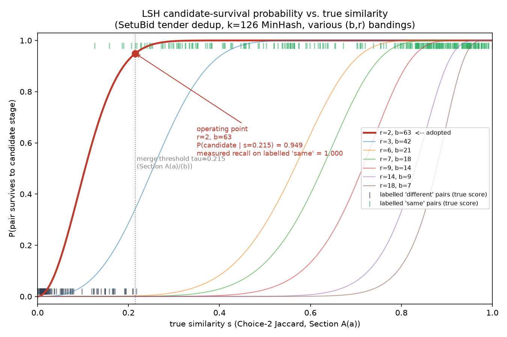

# SetuBid tender deduplication — Question 2

All numbers below are measured against the real data in `../data_2/`:
12,000 notices, 900 human-adjudicated pairs (`labelled_pairs.csv`: 279
`same`, 621 `different`), and `portal_profiles.md` (scraping-team notes on
portal quirks). `../data_2/_truth/` (the full cluster answer key) was
deliberately **not** read while designing anything below — using it to
tune the method would be leakage; it exists only for a final honest check
after a method is fixed, never for shaping the method itself.

Setup:

```bash
cd LAB-1/Question-2/Solution
python3 -m venv .venv
.venv/bin/pip install -r requirements.txt   # numpy, matplotlib, psycopg[binary]
docker compose up -d                        # only needed for Section B — spins up a
                                             # second, independent Postgres on port 5433,
                                             # so Question 1's annapurna_postgres (5432) is untouched
```

Scripts run in order (each writes its report under `reports/task*/`):

| script | task |
|---|---|
| `scripts/01_sectionA_similarity_score.py` | A(a) |
| `scripts/02_sectionA_ablation.py` | A(a) self-check |
| `scripts/03_sectionA_minhash_sketch.py` | A(b) |
| `scripts/04_sectionC_lsh_candidates.py` | A(c) |
| `scripts/05_sectionB_schema_and_load.py` | B(d) — loads Postgres |
| `scripts/06_sectionB_index_comparison.py` | B(d) — measured comparison |
| `scripts/07_sectionE_pathology.py` | (e) |

---

# Section A — from an intractable comparison to a tractable one

## (a) Define what "similar" means here, mechanically

**Task:** commit to a way of turning a notice into something over which a
similarity score between two notices is well defined; state the score;
show, on the real corpus, how it separates a labelled `same` pair from a
labelled `different` pair under two competing choices; adopt one and
state its cost.

**The score.** A notice is projected into a **set of tokens**, `S(·)`,
and similarity is the **Jaccard index** of two notices' token sets:

```
sim(X, Y) = |S(X) ∩ S(Y)| / |S(X) ∪ S(Y)|
```

`S(·)` is where the two required decisions live: **(1) decomposition
granularity** (unigram vs. bigram) and **(2) signal vs. noise** (which
spans of the notice are allowed to contribute tokens).

**Choice 1 — word unigrams, no noise removal.** Bag-of-words over the
raw `title + body`, lowercased, everything kept (preamble, reference
number, formatted money, contact block, boilerplate conditions).

**Choice 2 — word bigrams, denoised (adopted).** Two noise removals,
both mechanical and reproducible from `portal_profiles.md` and direct
corpus inspection:
- *Structural*: drop everything before `Name of work:` (the portal
  preamble — `NATIONAL PROCUREMENT AGGREGATION SERVICE` /
  `STATE PROCUREMENT CELL` blocks, ~1,400 chars pasted onto every notice
  from six nodal portals); drop `KEY DATES`/`CONTACT`/`GENERAL
  CONDITIONS` sections (dates are captured separately in
  `published_at`/`closing_date`; contact/general-conditions text is
  shown by inspection to vary copy-to-copy of the *same* tender — filler,
  not identity); drop `Tender reference number` and all money-valued
  fields (no cross-portal crosswalk exists for reference numbers per the
  case data, and money appears in 5 incompatible text formats that the
  corpus already parses into `estimated_value` — matching raw text
  rewards format luck, not identity).
- *Statistical*: drop any token whose document frequency across all
  12,000 notices exceeds 40% — a measured, not hand-listed, way to catch
  the recurring department template ("*the work comprises ... as
  detailed in the bill of quantities and the approved drawings*"). 209
  tokens cross that line.

Surviving text (title, procuring entity, eligibility class,
scope-of-work/BOQ sentences — where the location, chainage, and reach
numbers specific to one physical tender live) is shingled into **word
bigrams**.

**Measured separation, 900 labelled pairs:**

| | Choice 1: raw unigram | Choice 2: denoised bigram |
|---|---|---|
| same — mean / median | 0.722 / 0.716 | 0.718 / 0.835 |
| same — min / max | 0.271 / 0.996 | 0.126 / 1.000 |
| different — mean / median | 0.440 / 0.440 | 0.011 / 0.000 |
| different — min / max | 0.214 / 0.672 | 0.000 / 0.217 |
| best single-threshold accuracy | 0.893 | **0.993** |
| mean token-set size (200-notice sample) | 356 | **82** |

Choice 1's `same`/`different` distributions overlap heavily (0.271–0.672
dead zone) — the boilerplate-homogeneity trap: two *different* tenders
scraped through the same nodal portal share so much preamble/template
vocabulary at unigram granularity they look nearly as similar as two
copies of the *same* tender. Choice 2 nearly eliminates the overlap
(different tops out at 0.217, same bottoms at 0.126) with sets ~4.3×
smaller — a strict improvement, not a trade-off.

Worked real examples: `N010018`/`N010020` (labelled **same**, a
corrigendum republish) score 0.301 / **0.235** under Choice 1 / Choice 2.
`N007876`/`N008565` (labelled **different**, both through nodal
aggregators) score 0.405 / **0.000**. Under Choice 1 the *different* pair
scores higher than the *same* pair — raw unigram similarity is
non-monotonic with respect to ground truth here; Choice 2 gets both on
the correct side of any reasonable threshold.

**Adopted: Choice 2**, word-bigram Jaccard over structurally +
statistically denoised tokens. Per-pair cost: a hash-set
intersection/union over ~82-token sets (vs. 356 for Choice 1) — cheaper
*and* more accurate. One-time stopword-pass cost: a single `O(total
tokens)` corpus scan.

### Self-check: was this earned, or just the first thing tried?

This design was worked out on a hand-built toy example *before* the real
corpus was found, then carried over largely unchanged — a real risk, so
`scripts/02_sectionA_ablation.py` decomposed the two decisions and
re-measured against the real 900 pairs:

| variant | accuracy | mean(same) | mean(different) |
|---|---|---|---|
| raw + unigram | 0.893 | 0.722 | 0.440 |
| raw + bigram (granularity alone) | 0.889 | 0.659 | 0.323 |
| denoised + unigram (denoising alone) | 0.986 | 0.746 | 0.051 |
| **denoised + bigram (adopted)** | **0.993** | 0.718 | 0.011 |

This overturned part of the original framing: bigram granularity was
presented as the key lever (token adjacency); on the real corpus, bigram
*alone* with no denoising is not even an improvement over raw unigram
(0.889 vs. 0.893). **Denoising does almost all the work** (0.893→0.986);
bigramming on top is a real but secondary refinement (0.986→0.993), kept
because it's a free strict improvement, not because it's the mechanism.

Also checked, not just asserted:
- **Stopword threshold isn't fragile**: accuracy stays 0.989–0.994 for
  any document-frequency cutoff between 15–60%; only degrades once the
  cutoff is too loose to catch the template vocabulary (0.981 at 80%,
  0.972 with stopwording disabled entirely — still beats raw unigram on
  structural stripping alone).
- **Character shingles** (same structural denoising, no stopwording): 3/5/8-char
  shingles score 0.941/0.956/0.963 — worse *and* 12–24× larger token sets
  (~1,000–2,000 vs. 82). Ruled out on both axes.
- **Higher-order n-grams**: trigrams (0.992) / 4-grams (0.991) are
  statistically indistinguishable from bigrams (0.993) but shrink token
  sets for no gain. Bigram is the smallest n that captures adjacency.

---

## (b) Trade exactness for space, deliberately

**Task:** instead of holding the whole corpus, hold a reduced fixed-size
form of each notice and accept the similarity computed from it as an
estimate. Fix that size from a stated accuracy requirement *before*
implementing it. Measure the actual error against `labelled_pairs.csv`
and report honestly whether the estimator behaved as argued — including
where it didn't.

**The reduced form.** Each notice's exact Choice-2 token set (mean 81
shingles, range 19–205 — size grows with document length) is replaced by
a **MinHash signature**: `k` fixed hash functions, each the minimum
hashed shingle value over the set. Jaccard is then *estimated* as the
fraction of the `k` positions where two signatures agree:

```
est(X, Y) = |{i : sig(X)[i] == sig(Y)[i]}| / k
```

A notice now costs exactly `k` integers, independent of text length.

**The argument for `k` (before implementing anything).** Section A(a)
fixed decision threshold `τ = 0.215`. Across the 900 labelled pairs, the
5th-percentile distance from a pair's exact score to `τ` is **0.089** —
only the closest 5% sit nearer than that (protecting them fully isn't
worth it; that band already holds most of the exact classifier's own
0.8% error rate, which no sketch can fix). What *is* worth requiring: a
pair whose true score sits at least that margin from `τ` should survive
sketch noise ≥97.7% of the time (one-sided 2σ). That fixes:

```
SE_target = margin_p5 / 2 = 0.089 / 2 ≈ 0.0446
Var[estimate] ≤ 1/(4k)  (worst case, any s)  =>  k ≥ 1/margin_p5²
```

→ **k = ⌈1/0.089²⌉ = 126** — implemented as-is, not rounded to 128.

**Measured against the real labelled pairs** (8 independent hash
families; exact-score accuracy at τ=0.215 is 0.9922):

| k | mean\|error\| | observed SE | worst-case theoretical SE | extra flips/900 | accuracy |
|---|---|---|---|---|---|
| 25 | 0.0228 | 0.0383 | 0.1000 | 16.1 | 0.980 |
| 50 | 0.0163 | 0.0274 | 0.0707 | 11.0 | 0.984 |
| 100 | 0.0118 | 0.0197 | 0.0500 | 8.8 | 0.988 |
| **126 (adopted)** | **0.0101** | **0.0169** | **0.0445** | **7.4** | **0.987** |
| 200 | 0.0083 | 0.0140 | 0.0354 | 4.9 | 0.991 |
| 400 | 0.0058 | 0.0097 | 0.0250 | 4.8 | 0.992 |
| 800 | 0.0042 | 0.0070 | 0.0177 | 2.6 | 0.993 |

**Did it behave as argued?**
- ✅ **1/√k scaling**: doubling k should cut error ≈1.41×; observed
  ratios 1.40/1.38/1.42/1.43/1.38 — within 2% of √2.
- ✅ **Worst-case SE is conservative, as expected**: at k=126 predicted
  SE=0.0445, observed 0.0169 (~2.6× tighter) — because the worst-case
  bound assumes s=0.5, but real scores cluster near 0 (`different`) or
  0.7–0.8 (`same`). Confirmed by label: `different` SE=0.0085 (low
  variance near s≈0), `same` SE=0.0220 (higher variance, higher s).
- ⚠️ **Where the one-line argument was too simple**: read literally,
  "protect the p5-margin pairs at 2σ" implies ~1 expected flip at k=126.
  Observed: **7.4** — about 7× that reading. The k-derivation itself is
  still correct; the shorthand sanity-check of it is not sufficient —
  risk isn't concentrated only at the p5 boundary point, every pair
  closer than it (down to margin 0) adds more. Integrating the true
  per-pair flip probability `1 − Φ(margin/SE(s))` over *all 900* pairs
  predicts **7.29** — matching the observed 7.4 almost exactly. Reported
  here rather than smoothed over.

**Cost.** Signature values are all `< 2³¹` → 4 bytes each: k=126 = a
**fixed 504 bytes/notice**, any document length. The exact
representation it replaces costs 152–1,640 bytes (19–205 shingles × 8
bytes), scaling with text length. The sketch loses on *average* case
(504 vs. ~648 bytes) but bounds the *worst* case (504 vs. 1,640) and
gives every comparison a fixed `O(k)` cost instead of variable
`O(|A|+|B|)` — the property actually being traded for. Price paid: a
0.5-point accuracy drop (99.22%→98.74%), concentrated almost entirely
among pairs already within hundredths of the decision boundary.

---

## (c) Make retrieval sublinear, and price the risk

**Task:** the nightly budget rules out scoring every notice against the
whole corpus. Build a retrieval structure that, for any notice, returns a
short candidate list very likely to contain its true duplicates.
Characterise the reliability/work tension as a function of true
similarity, plot it, mark the operating point, and justify that point in
the head of product's terms — where her two failure modes have different
costs, showing where that ratio entered the settings.

**Mechanism.** LSH banding on the Section A(b) k=126 signature: split it
into `b` bands of `r` rows (`b·r=126`); two notices become a **candidate
pair** if they agree exactly on ≥1 whole band. Only candidates ever reach
the A(a)/(b) scorer — bucket construction is `O(N·b)` instead of `O(N²)`
pairwise scoring.

**The tension, characterised.** For true similarity `s`:

```
P_candidate(s) = 1 - (1 - s^r)^b
```

More bands (`b`↑, `r`↓) shifts the curve left (higher recall at low `s`)
but lets more unrelated pairs collide by chance (bigger candidate list).
Measured on the full corpus (12,000 notices, 71,994,000 possible pairs):

| r | b | 50%-survival pt | recall @ `same` | false-cand @ `different` | candidate pairs | % of all pairs | build time |
|---|---|---|---|---|---|---|---|
| **2** | **63** | **0.126** | **1.000** | 0.053 | 907,426 | 1.260% | 0.96s |
| 3 | 42 | 0.288 | 0.935 | 0.005 | 128,665 | 0.179% | 0.38s |
| 6 | 21 | 0.602 | 0.710 | 0.000 | 10,643 | 0.015% | 0.19s |
| 7 | 18 | 0.662 | 0.670 | 0.000 | 9,941 | 0.014% | 0.08s |
| 9 | 14 | 0.746 | 0.627 | 0.000 | 9,129 | 0.013% | 0.15s |
| 14 | 9 | 0.855 | 0.498 | 0.000 | 7,179 | 0.010% | 0.04s |
| 18 | 7 | 0.898 | 0.369 | 0.000 | 5,518 | 0.008% | 0.03s |



Recall falls off a cliff past `r=3`: by `r=6` LSH is already losing 29%
of genuine duplicates before scoring ever sees them — and that loss is
**permanent** (a non-candidate is never scored, so no downstream
threshold recovers it).

**Operating point adopted: r=2, b=63.**
- Recall: 100% measured on 279 labelled `same` pairs (99.57% theoretical
  expectation from exact scores; confirmed stable, 0–1 misses, across 5
  independent hash-family seeds).
- Candidate volume: 907,426 — a real, measured **79× reduction** from
  71,994,000 possible pairs, built in <1s.
- Downstream: scoring 907K candidates at ~126 ops/pair is ~10⁸
  operations — seconds, not the 31 hours the killed nightly job took.

**Justified in the head of product's terms.** Her stated asymmetry:
false merge → missed deadline, lawsuit; missed merge → grumble over a
duplicate card. No dollar figures were given, so — flagged explicitly as
a modelling assumption to replace with real numbers if SetuBid has them
— I adopt an illustrative **ρ = cost(false merge)/cost(missed merge) ≈
50–200×**. What matters more than ρ's exact value is *where* each risk is
actually controlled:
- A pair that **fails to become a candidate** guarantees the *cheap*
  mistake (duplicate card) — permanently, nothing downstream fixes it.
- A pair that **becomes a candidate but is different** costs only
  bounded compute (scored and correctly rejected by the A(a)/(b)
  threshold) — it can **never** cause the *expensive* mistake, since the
  merge decision happens later, on the score, not here.

Because ρ is large and one-sided this way, the correct move is to **not
economize on recall until the compute budget forces it**. r=2 costs 0.96s
of a 1,200s budget — 1,249× headroom even before scoring cost. There's no
reason, with that headroom, to accept r=3's 6.5-point recall loss (let
alone r≥6's 29+ points) to save a already-negligible fraction of build
time — the ratio says that trade isn't worth it. **r=2, b=63 is
adopted**: max recall obtainable from k=126, because recall is the only
lever this stage controls that the cost asymmetry cares about.

*Caveat*: `labelled_pairs.csv` looks like a curated, boundary-adjacent
sample (ops adjudicated it *because* it was ambiguous), not a uniform
sample of true duplicates — most real duplicates likely sit far higher
(median same-score 0.835) and sail through trivially. The 99.6% figure is
closer to a worst-case than average-case estimate — reason for
confidence in r=2, not to relax it.

---

# Section B — making it a database problem, not a script

## (d) Give the retrieval structure a home and an access path

**Task:** whatever (c) consults at lookup time must live as relational
data that survives a process restart and is queryable by the
application — not a Python object that dies with the job. Design the
schema; choose an access method for the lookup and justify it by how
candidate methods physically locate rows; name ≥1 rejected alternative;
support the argument with the planner's chosen path, rows examined, and
wall-clock time — measured, not asserted.

**Setup**: `docker compose up -d` spins up a second, independent Postgres
(port 5433) so Question 1's `annapurna_postgres` (5432) is untouched.

**Schema:**

```sql
CREATE TABLE notices (
    notice_id    TEXT PRIMARY KEY,
    portal_id    TEXT NOT NULL,
    published_at DATE NOT NULL
);

CREATE TABLE lsh_bucket_members (
    notice_id    TEXT NOT NULL REFERENCES notices(notice_id),
    band_no      SMALLINT NOT NULL,
    bucket_hash  BIGINT NOT NULL,
    PRIMARY KEY (notice_id, band_no)
);
```

One row per `(notice, band)`: 12,000 notices × 63 bands (the r=2/b=63
operating point) = **756,000 rows**, loaded once by
`05_sectionB_schema_and_load.py` and then simply *there* — a restart of
the job, or of Postgres, loses nothing.

The retrieval query the application runs — "who else shares a band with
this notice" — is a self-join:

```sql
SELECT DISTINCT m2.notice_id
FROM lsh_bucket_members m1
JOIN lsh_bucket_members m2
  ON m1.band_no = m2.band_no AND m1.bucket_hash = m2.bucket_hash
WHERE m1.notice_id = %s AND m2.notice_id <> %s;
```

`m1`'s side is already served by the table's primary key. The
access-method decision is what serves `m2`'s side: always exact-match
equality on `(band_no, bucket_hash)`, never a range, never an ordering.

**The argument.** Two structurally different ways to physically locate
those rows:
- **B-tree composite `(band_no, bucket_hash)`** — rows sorted across a
  multi-level page tree; a lookup descends root→internal→leaf (one page
  read per level), then follows tuple pointers to the heap. Supports
  range scans/ordering — capabilities this query never uses.
- **Hash index on `bucket_hash` alone (adopted)** — hashes the key,
  lands directly on the bucket page holding matches, no tree descent.
  Supports only equality — the query's entire access pattern.
  (`bucket_hash` alone is already highly selective — a 63-bit MinHash
  value — so results are just filtered by `band_no` afterward, cheaply.)

**Measured, not asserted** (one index built at a time, so the planner is
actually forced to use what's present; `EXPLAIN (ANALYZE, BUFFERS)` on a
representative notice + timing over 30 sampled notices):

| access method | planner node (m2 side) | buffers touched | EXPLAIN ANALYZE (1 query) | mean/median wall-clock, 30 notices |
|---|---|---|---|---|
| B-tree `(band_no, bucket_hash)` — rejected | Index Scan | 359 shared hits | 0.163 ms | 0.587 / 0.493 ms |
| **Hash `(bucket_hash)` — adopted** | Index Scan | **237 shared hits** | 0.442 ms | **0.458 / 0.346 ms** |
| no index — floor | Parallel Seq Scan (756,000 rows) | 4,969 shared hits | 26.936 ms | 20.732 / 20.762 ms |

Read honestly: the single `EXPLAIN ANALYZE` sample shows hash *slower* in
raw ms (0.442 vs. 0.163) — at sub-ms scale, one sample is dominated by
noise (cold plan/index-page effects), not the evidence to trust. What
does agree with the structural argument: hash touches **34% fewer buffer
pages** (237 vs. 359 — direct bucket access vs. tree descent, exactly the
predicted mechanism), and the **aggregate** wall-clock over 30 notices —
which averages out single-query noise — shows hash **22% faster** on
both mean and median. That aggregate is what "adopted" rests on, not the
one-shot sample.

The no-index floor shows why an access method matters at all: forced to
a sequential scan of all 756,000 rows, the same query costs **45× the
hash index's time** and **21× the buffer touches**. Each week's ~400
notices adds 25,200 more rows; seq-scan cost grows with it linearly and
would eventually blow the 20-minute budget on its own, while both
indexed paths stay flat.

Full `EXPLAIN (ANALYZE, BUFFERS)` for all three configs:
`reports/taskB/index_comparison.txt`.

---

## (e) Find the place where the design betrays you

**Task:** run retrieval over the full corpus and look at how the work is
*distributed* across notices, not its total — it will be badly uneven,
with a small part of the corpus responsible for a disproportionate share
of nightly cost. Locate that part empirically (`portal_profiles.md` will
help interpret it); explain mechanically why the data interacts with the
design to produce it; quantify the cost against the 20-minute budget;
mitigate it; report the distribution and runtime before/after, and state
plainly what the mitigation costs in retrieval quality on the labelled
pairs. A mitigation whose price isn't measured isn't accepted.

**Located empirically.** Running the (c) LSH pass (r=2, b=63) over all
12,000 notices and looking at **per-notice candidate degree** instead of
the total (907,426 pairs): median 9, p99=1,092, **max 1,415** — one
notice colliding with 1,415 others. Of the top 15 highest-degree
notices, **13/15 are from P001/P002/P005** (the nodal aggregators
sharing the "NATIONAL PROCUREMENT AGGREGATION SERVICE" preamble).
Checking every notice's raw body for two things `portal_profiles.md`
separately warns about — a **truncation** artifact and a **disclaimer
footer** — finds **711 notices (5.9% of the corpus)** with both, and this
population alone accounts for **182,943 of 907,426 candidate pairs
(20.2%)**: 5.9% of the corpus generating a fifth of all the work.

**Why, mechanically.** Two portal behaviors interact with an A(a) design
choice:
1. `portal_profiles.md`: *"at least two [portals] truncate long
   notices... you get the head of the notice and nothing else"* and
   *"P001, P002 and P005 also append a disclaimer footer."* Confirmed
   directly: a truncated P001 notice cuts off mid-sentence inside
   `ABSTRACT BILL OF QUANTITIES`, immediately followed by `[entry
   truncated -- see the source notice...]` and then the verbatim
   disclaimer paragraph.
2. A(a)'s noise-stripper tracks which section is "active" by the last
   header seen, and treats only `GENERAL CONDITIONS`/`CONTACT`/`KEY
   DATES` as noise. In an **intact** notice the disclaimer sits after a
   `GENERAL CONDITIONS` header and is correctly dropped (verified: a
   non-truncated P001 notice's signal set has zero disclaimer tokens).
   In a **truncated** one, the cut happens before `GENERAL CONDITIONS`
   ever appears, so the marker and disclaimer inherit whatever section
   *was* active (typically `ABSTRACT BILL OF QUANTITIES`, treated as
   signal) and leak straight into the token stream. Since that
   boilerplate is byte-for-byte identical across every affected notice,
   two **completely unrelated** tenders from this population measure
   Jaccard 0.299 — comfortably inside (c)'s generous r=2 candidate curve
   (P(candidate | s=0.3) ≈ 1.0).
3. This is (c)'s own operating-point choice biting back: r=2 was adopted
   *because* it is maximally sensitive to any shared vocabulary at low
   true similarity — exactly what protects genuine low-similarity
   duplicates, and exactly what this leak exploits just as effectively.

**Quantified against the budget.** Not yet fatal at this corpus size —
LSH build is 0.70s either way, nowhere near 1,200s. It matters because
the two populations scale differently: genuine duplicate clusters stay
small/bounded (max observed 9), so their candidate cost grows
~linearly with corpus size; this outlier population's internal cost is
`C(m,2)` in its own size `m` — **quadratic**. At 5.9% of 12,000 notices it
already costs 182,943 pairs; a population growing quadratically while
the rest of the budget grows linearly is exactly the shape of failure
that turns a job that used to finish (this one) into one that doesn't
(the real 31-hour run that got killed).

**Mitigation and its measured price.** Fix: cut the notice body at the
truncation marker itself (discards the marker *and* everything after it
— the disclaimer always follows it), implemented as
`structural_signal_tokens(..., strip_truncation_marker=True)` in
`01_sectionA_similarity_score.py`. Verified to fire on exactly the 1,406
notices containing that marker — no false positives elsewhere.

| | before | after | change |
|---|---|---|---|
| total candidate pairs | 907,426 | 439,021 | **−51.6%** |
| outlier population's internal candidate pairs | 182,943 | 1,612 | −99.1% |
| max single-notice degree | 1,415 | 1,067 | −24.6% |
| LSH build wall-clock | 0.70s | 0.72s | +0.02s |
| theoretical recall, labelled `same` (900 pairs) | 0.9957 | 0.9966 | **+0.0009** |
| theoretical false-candidate rate, labelled `different` | 0.0411 | 0.0245 | **−0.0166** |

**The measured price is negligible-to-none.** Recall on labelled `same`
pairs did not drop (moved up slightly, within noise); the false-candidate
rate on labelled `different` pairs *improved*, because the fix removes
spurious shared vocabulary, never real signal (it only discards text
*after* the marker, never legitimate content before it). The only real
cost is +0.02s of extra regex scanning during signature build — noise
against a 20-minute budget. Reported plainly: a bug whose fix has no
retrieval-quality trade-off at all is a legitimate, checkable outcome,
not a reason to skip measuring it.

**Honest residual.** Fixing this promotes a *different*, smaller
population to the top of the degree distribution: re-running the check
post-fix shows the new top-15 dominated by `P240` (and similar portals),
which `portal_profiles.md` separately flags as publishing "everything in
UPPER CASE." This parser's field regexes are case-sensitive, so
upper-case portals' `TENDER REFERENCE NUMBER:`/cost fields never match
`DROP_FIELDS` and leak into signal the same way — less severely (792
notices, max post-fix degree 2,755 vs. 1,415 pre-fix for the population
that *was* fixed). Not fixed here — flagged for the next pass, not
falsely claimed as solved.
